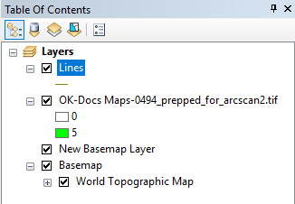
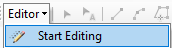
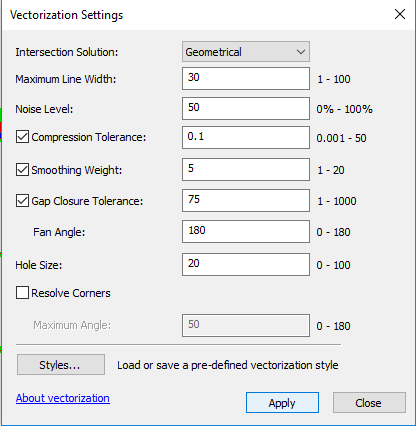
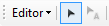
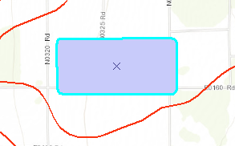

## About
Last Updated *[09/26/2019]*   
Created by [OSU Maps and Spatial Data](https://info.library.okstate.edu/map-room)

## Table of Contents
- Introduction 
- *[ArcScan]*
- - Getting Started
- - Georeferencing 
- - Vectorization
- - Polygons
- Conclusion
- Further Reading/Resources

## Introduction

## *[ArcScan]*

#### Getting Started
1. Open ArcMap on your desktop.
2. Add a folder connection. Open the *Catalog* pane, right click **Folder Connections** and select **Connect to Folder**.

3. Drag and drop the map you would like to vecotrize into the *Table of Contents* pane. 
4. Add a basemap. To add a basemap, click the arrow next to the **Add Data** icon in the toolbar and select **Add basemap**. Select the desired basemap and click **Add**.

Note: **Topographic** is a good basemap choice.

5. The map you wish to edit must consist of only two values/colors. (binary raster) (HELP WITH WORDING)
  
  - 1. In the *Table of Contents* pane, right click the map you wish to edit and select **Properties**.

  - 2. Go to the *Symbology* tab and select **Unique Values**. 

  - 3. Remove all but two of the values by selecting them and clicking **Remove**. Only two values should remain. 

  - 4. Click **Apply**.

#### Georeferencing
1. To start georeferencing in ArcMap, the georeferencing toolbar needs to be opened. Right click in the toolbar and click **Georeferencing**. A checkmark should appear next to it. 

2. A *georeferncing* toolbar should appear and control points can be added. 

Note: For more information of georeferencing, visit (instert link here).

3. Once all necessary control points have been added, click **Update Georeferencing** under **Georeferencing** in the toolbar. 

#### Vectorization

1. Before vectorization can begin, make sure *ArcScan* is turned on. In the toolbar, click **Customize** then **Extensions**. Make sure there is a checkmark next to **ArcScan**.

2. Next, right click anywhere in the toolbar and make sure a checkmark is next to **ArcScan**. If there is not, click ArcScan and a new toolbar should appear. 

3. Create a shape file. 

- 1. In *Catalog*, right click the geodatabase file. Select **New** and **Feature Class**.

- 2. Name the file and make sure the *Type* is set to **Line Features**.

- 3. Select the desired coordinate system. Make sure it is the same as the basemap and other data being used. 
- 4. Once done, select **Finish**. A new layer should appear in the *Table of Contents*. 

4. Start and editing session. 

- 1. Right click in the toolbar and click **Editor**. A new toolbar should appear. 

- 2. Under *Editor* click **Start Editing**.

- 3. Select the polyline layer you created and click **OK**. 

5. In the ArcScan toolbar under *Vectorization*, click **Show Preview**.

6. Compare the previewed vectors to the original raster data. 

7. If you are happy with the results, under *Vectorization* select **Generate Features**.

8. If the preview is not satisfactory, the vectors can be edited.

- 1. Under *Vectorization*, select **Vectorization Settings**. (HELP! LINK TO SETTING EXPLAINATION?)

- 2. A new window should appear. Here, the settings may be adjusted. 

- 3. When the settings have been adjusted as desired, cick **Apply**.

  - Vectorization Settings Explained
    - Adjusting the **Maximum Line Width** allows you to include or exclude certain features based on how wide the lines are. If you only want to include thin lines, decrease the maximum line width. If you would like to include more lines, increase the maximum line width.
    - **Compression Tolerance** allows you to adjust the angularity of the vectors by incorporating more or less vertices. The more vertices that are featured, the less angular the vectors will be. Reducing the number of vertices will likely result in a deviation from the original shape. 
    - By adjusting the **Smoothing Weight** you can generate features that are more or less smooth than the original features. Increasing the smoothing weight may result in a deviation from the original shape. 
    - The **Gap Closure Tolerance** setting can be used to close unwanted gaps. Oftentimes, when a raster contains gaps, the previewed vector will also contain gaps. By increasing the tolerance, these gaps can be closed if desired. 
    - To increase the accuracy of the gap closure tolerance, the **Fan Angle** setting can be adjusted. The fan angle determines where gaps are that can be closed, which is especially useful when the raster you are working with is curved. 
    - Holes can be ignored by adjusting the **Hole** setting. If a small hole appears, you can choose to ignore it and the vector will cross over it instead of going around it. 
    - **Resolve Corners** can be used to determine how angular or rounded the vector's corners are. 
    - For more details on the different vectorization settings, click **About vectorization** at the bottom of the *Vectorization Settings* window. 

9. You may now generate the features, or continue editing with **Raster Cleanup**. 

- 1. Under *Raster Cleanup*, click **Start Cleanup**. 

- 2. Open the **Raster Painting Toolbar**. 

- 3. There are a variety of tools that can be used to edit the vectors before they are generated. 
  - Erase
  1. To erase a feature, simply click the eraser icon on the toolbar.
  
  
  
  2. Click and drag the mouse over the feature you wish to erase. 
  
  
  
  
  
  - Magic Erase
  1. Click on the magic eraser icon
  
  ![Magic Erase](images/MagicErase.PNG]
  
  2. Make sure the feature you wish to erase is not connected to any other feature.
  
  
  
  3. Simply click on the feature you wish to create. It should disappear entirely. 
  
  
  
  - Brush 
  1. Click on the brush icon.
  
  
  
  2. This tool can be used to add lines where they are needed. 
  
  
  
  3. Simply click and drag the mouse where you would like to add a line or feature. 
  
  
  
10. Save edits often to ensure no progress is lost. Simply click **Save Edits** under *Editor* in the *Editor* toolbar.

11. To end an editing session, click **Stop Editing** under *Editor* in the *Editor* toolbar. Be sure to do this after you have generated the vector features. 

#### Polygons
Now that vectors have been created, you can create polygon features.

1. Create a new **Feature Class** as previously mentioned, but be sure to set the *Type* as **Polygon Features**. Continue through the next few steps as listed above and click **Finish**. The new layer should appear in the *Table of Contents*.
2. Begin a new editor session and select the polygon layer. 
3. Click the **Edit Tool**.

4. Right click anywhere in the toolbar and click on **Advanced Editing** to open the *Advanced Editing* toolbar.

5. Select the vectors you would like to use to create a polygon. There are two ways to do this.
- You can click and drag the mouse to select features.
- OR you can select vectors by holding **CTRL and Shift** as you click on the lines you wish to include. This option allows you to be more specific. 

 

6. On the *Advanced Editing* toolbar, select the **Construct Polygons** icon. 

7. A pop up will appear. Click **OK**. 

8. A polygon should appear. 

## Conclusion

## Further Reading/Resources
 **LINK TO GEOREFERENCING GUIDE**

[Return to Top](#about)
