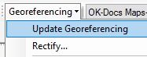

## About
Last Updated *[09/26/2019]*   
Created by [OSU Maps and Spatial Data](https://info.library.okstate.edu/map-room)

## Table of Contents
- Introduction 
- *[ArcScan]*
- - Getting Started
- - Georeferencing 
- Conclusion
- Further Reading/Resources

## Introduction

## *[ArcScan]*

#### Getting Started
1. Open ArcMap on your desktop.
2. Add a folder connection. Open the *Catalog* pane, right click **Folder Connections** and select **Connect to Folder**.

3. Drag and drop the map you would like to vecotrize into the *Table of Contents* pane. 
4. Add a basemap. To add a basemap, click the arrow next to the **Add Data** icon in the toolbar and select **Add basemap**. Select the desired basemap and click **Add**.

Note: **Topographic** is a good basemap choice.

5. The map you wish to edit must consist of only two values/colors. (HELP WITH WORDING)
- 1. In the *Table of Contents* pane, right click the map you wish to edit and select **Properties**.

-2. Go to the *Symbology* tab and select **Unique Values**. 

-3. Remove all but two of the values by selecting them and clicking **Remove**. Only two values should remain. 

-4. Click **Apply**.

#### Georeferencing
1. To start georeferencing in ArcMap, the georeferencing toolbar needs to be opened. Right click in the toolbar and click **Georeferencing**. A checkmark should appear next to it. 

2. A *georeferncing* toolbar should appear and control points can be added. 

Note: For more information of georeferencing, visit (instert link here).

3. Once all necessary control points have been added, click **Update Georeferencing** under **Georeferencing** in the toolbar. 

#### ArcScan
1. Before vectorization can begin, make sure *ArcScan* is turned on. Right click anywhere in the toolbar and make sure a checkmark is next to **ArcScan**. If there is not, click ArcScan and a new toolbar should appear. 

## Conclusion

## Further Reading/Resources
 **LINK TO GEOREFERENCING GUIDE**

[Return to Top](#about)
